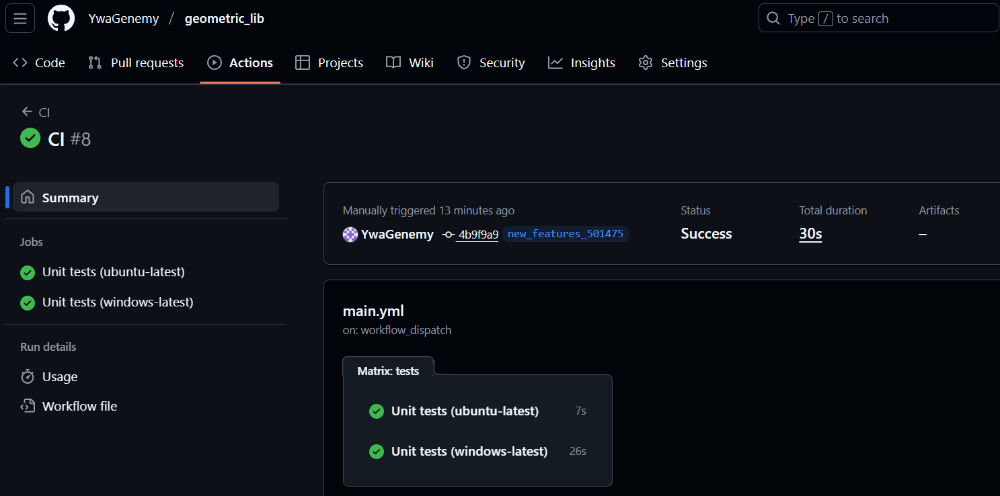

# Отчет по лабораторной работе №5

## Тема: Знакомство с CI_CD

### Автор: Колодезников Андрей ИСУ: 501475

## Цель

Настроить GitHub Actions для автозапуска unit-тестов на двух раннерах (ubuntu-latest, windows-latest) при каждом push.

## Выполненные шаги

1. Создан workflow `.github/workflows/main.yml`.
2. Настроены триггеры: `push` (ветки main и new_features_501475), `pull_request` в main, ручной запуск `workflow_dispatch`.
3. Добавлен job `tests` с матрицей ОС: ubuntu-latest, windows-latest.
4. Шаги job: checkout кода, установка Python 3.x, обновление pip, установка зависимостей при наличии `requirements.txt`, запуск `python -m unittest discover -v`.
5. Запущен workflow (push/ручной), проверены логи выполнения на обеих ОС.

## Результаты

- Workflow выполняется успешно на обоих раннерах.
- Все unit-тесты проходят.

## Приложения

- Файл workflow: `.github/workflows/main.yml`.
- `main.yml` и скриншот успешного прогона workflow (ubuntu + windows) — будут приложены ниже.

## `main.yml`

```
name: CI
on:

  push:
    branches: [ "main", "new_features_501475"]

  pull_request:
    branches: [ "main" ]
  workflow_dispatch:

jobs:


  tests:
    name: Unit tests (${{ matrix.oper-system }})
    runs-on: ${{ matrix.oper-system }}

    strategy:
      fail-fast: false #если хотябы один эелмент oper-sysetm не смог запустить, то на этом не останвлаиаемся

      matrix:
        oper-system: [ubuntu-latest, windows-latest]

    steps:
      - name: Checkout
        uses: actions/checkout@v4 #git clone ...

      - name: Set up Python
        uses: actions/setup-python@v5 #prog language
        with:
          python-version: "3.x" #version language

      - name: Install dependencies
        shell: bash #terminal
        run: |
          python -m pip install --upgrade pip
          if [ -f requirements.txt ]; then pip install -r requirements.txt; fi

      - name: Run unit tests
        shell: bash
        run: python -m unittest discover -v


```

## `Screenshot`


